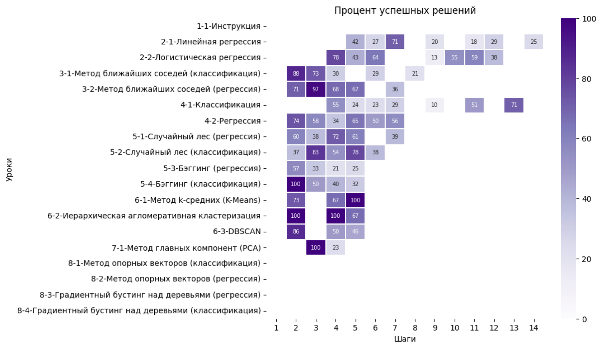

# Графики для Степика
Примеры реализации графиков о статистике одного курса, основанные на данных API Stepik'а.

## Инструкция
Для построения графиков на данных вашего курса:
1. Создайте в Stepik'e [приложение](https://stepik.org/oauth2/applications/) и получите Client id и Client secret.
2. Пропишите во второй ячейке [ноутбука](https://github.com/slivka83/stepik_stat_plots/blob/main/stepik_plot.ipynb) идентификатор вашего курса, Client id и Client secret.
3. Последовательно выполните все ячейки в нутбуке.

## Примеры графиков

